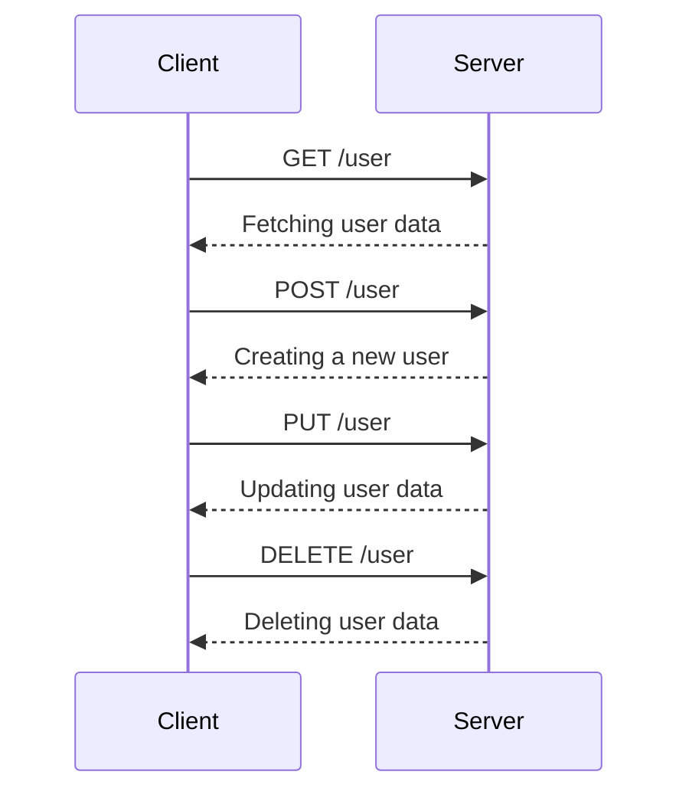
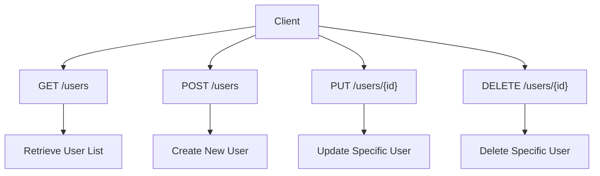
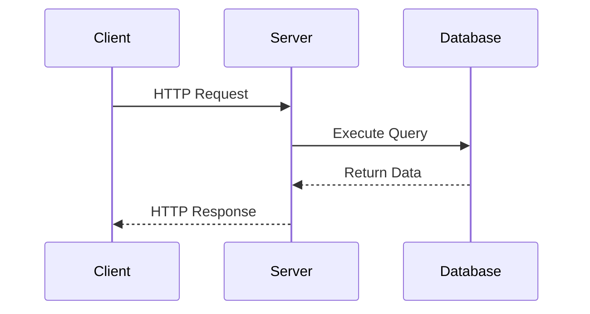

# **API Development in GoLang**

## **1. General Basics of Web Servers and APIs**

### **What Is a Web Server?**
- A **web server** is software that listens for incoming HTTP requests from clients (e.g., browsers, mobile apps) and responds with appropriate data.
- In Go, the `net/http` package provides tools to create web servers.

#### **Key Concepts**
- **HTTP Protocol**: The foundation of communication over the web. It defines how clients and servers exchange data.
- **Endpoints**: URLs where the API can be accessed.
- **Request/Response Cycle**:
  - **Request**: Sent by the client, containing headers, method (e.g., GET, POST), and optionally a body.
  - **Response**: Sent by the server, containing status code, headers, and optionally a body.
- **Data Formats**: APIs typically use JSON or XML for data exchange, with JSON being the most common.

---

### **What Is an API?**
- An **API (Application Programming Interface)** defines how different software components interact.
- APIs expose endpoints that clients can use to perform actions or retrieve data.

#### **Types of APIs**
| Type                | Description                                                                 |
|---------------------|-----------------------------------------------------------------------------|
| **RESTful APIs**    | Follow REST architecture principles (stateless, resource-based).            |
| **GraphQL APIs**    | Allow clients to request specific data structures.                          |
| **SOAP APIs**       | Use XML for message formatting and are protocol-based.                      |

---

## **2. Basics of Creating an API Server Using GoLang**

### **Steps to Create a Simple API Server**
1. **Import Required Packages**:
   - Use the `net/http` package to handle HTTP requests and responses.
2. **Define Handlers**:
   - Handlers are functions that process incoming requests and return responses.
3. **Set Up Routes**:
   - Map URL paths to handlers.
4. **Start the Server**:
   - Use `http.ListenAndServe` to start the server on a specific port.

---

### **Example Code: Basic API Server**
```go
package main

import (
	"encoding/json"
	"fmt"
	"net/http"
)

type Response struct {
	Message string `json:"message"`
}

func helloHandler(w http.ResponseWriter, r *http.Request) {
	if r.Method != http.MethodGet {
		http.Error(w, "Method not allowed", http.StatusMethodNotAllowed)
		return
	}
	response := Response{Message: "Let Us Go!"}
	w.Header().Set("Content-Type", "application/json")
	json.NewEncoder(w).Encode(response)
}

func main() {
	http.HandleFunc("/hello", helloHandler)
	fmt.Println("Server is running on port 8080...")
	http.ListenAndServe(":8080", nil)
}
```

---

### **Output**
- Visit `http://localhost:8080/hello` in your browser:
  ```json
  {
    "message": "Let Us Go!"
  }
  ```

---

### **Explanation**
1. **Handler Function**:
   - The `helloHandler` function processes GET requests and returns a JSON response.
2. **Routing**:
   - The `/hello` endpoint is mapped to the `helloHandler`.
3. **Server Initialization**:
   - The server listens on port `8080`.

---

## **3. HTTP Verbs (GET, POST, PUT, DELETE)**

### **Overview**
HTTP verbs define the type of action being performed on a resource.

#### **Common HTTP Verbs**
| Verb      | Purpose                                                                 |
|-----------|-------------------------------------------------------------------------|
| **GET**   | Retrieve data from the server.                                          |
| **POST**  | Send data to the server to create a new resource.                       |
| **PUT**   | Update an existing resource or create it if it doesn't exist.           |
| **DELETE**| Remove a resource from the server.                                      |

---

### **Example Code: Handling Multiple HTTP Verbs**
```go
func userHandler(w http.ResponseWriter, r *http.Request) {
	switch r.Method {
	case http.MethodGet:
		w.Write([]byte("Fetching user data"))
	case http.MethodPost:
		w.Write([]byte("Creating a new user"))
	case http.MethodPut:
		w.Write([]byte("Updating user data"))
	case http.MethodDelete:
		w.Write([]byte("Deleting user data"))
	default:
		http.Error(w, "Method not allowed", http.StatusMethodNotAllowed)
	}
}

func main() {
	http.HandleFunc("/user", userHandler)
	http.ListenAndServe(":8080", nil)
}
```

---

### **HTTP Request Flow**


---

## **4. REST Architecture**

### **What Is REST?**
- **REST (Representational State Transfer)** is an architectural style for designing APIs.
- It emphasizes simplicity, scalability, and statelessness.

---

### **Key Principles of REST**
1. **Statelessness**:
   - Each request contains all necessary information. The server does not store client state between requests.
2. **Client-Server Separation**:
   - Clear separation between client and server logic.
3. **Uniform Interface**:
   - Consistent URL structure and resource naming conventions.
4. **Cacheability**:
   - Responses should indicate whether they can be cached.
5. **Layered System**:
   - Clients may interact with intermediate layers (e.g., proxies, load balancers).

---

### **RESTful Resource Design**
- Resources are identified by URLs (e.g., `/users`, `/products`).
- Operations on resources are performed using HTTP verbs:
  - `GET /users`: Retrieve a list of users.
  - `POST /users`: Create a new user.
  - `PUT /users/{id}`: Update a specific user.
  - `DELETE /users/{id}`: Delete a specific user.

---

### **RESTful API Structure**


---

### **Advantages of REST**
- **Simplicity**: Easy to understand and implement.
- **Scalability**: Stateless design allows horizontal scaling.
- **Flexibility**: Supports multiple data formats (JSON, XML).

---

### **Disadvantages of REST**
- **Over-fetching/Under-fetching**: Clients may receive more or less data than needed.
- **Verbosity**: Requires multiple requests for complex operations.

---

## **5. Routing in Golang**

Routing is a critical part of API development as it determines how incoming HTTP requests are handled and directed to the appropriate logic. Go provides multiple routing options, ranging from the default `net/http` package to third-party libraries like Gorilla Mux, Chi, and Gin.

---

### **Default Routing (Go 1.22+)**

Starting with Go 1.22, the `net/http` package has been enhanced with improved routing capabilities. The default router is lightweight and built into the standard library, making it ideal for simple applications.

#### **Features**
- **Basic Routing**: Supports static routes and HTTP methods.
- **No External Dependencies**: Since it's part of the standard library, no additional packages are required.
- **Limited Flexibility**: Lacks advanced features like route grouping, middleware support, or regex matching.

#### **Example Code: Default Router**
```go
package main

import (
	"fmt"
	"net/http"
)

func homeHandler(w http.ResponseWriter, r *http.Request) {
	if r.URL.Path != "/home" {
		http.NotFound(w, r)
		return
	}
	w.Write([]byte("Welcome Home!"))
}

func main() {
	http.HandleFunc("/home", homeHandler)
	fmt.Println("Server is running on port 8080...")
	http.ListenAndServe(":8080", nil)
}
```

---

### **Third-Party Routers**

While the default router is sufficient for basic use cases, third-party routers offer advanced features that simplify API development.

---

#### **1. Gorilla Mux**
Gorilla Mux is one of the most popular routing libraries in Go. It provides robust routing capabilities, including regex matching, subrouters, and middleware support.

##### **Features**
- **Regex Matching**: Define routes with regular expressions.
- **Subrouters**: Group related routes together.
- **Middleware Support**: Add cross-cutting concerns like logging or authentication.
- **HTTP Method Matching**: Route based on HTTP verbs.

##### **Example Code: Gorilla Mux**
```go
package main

import (
	"fmt"
	"net/http"

	"github.com/gorilla/mux"
)

func homeHandler(w http.ResponseWriter, r *http.Request) {
	w.Write([]byte("Welcome Home!"))
}

func userHandler(w http.ResponseWriter, r *http.Request) {
	params := mux.Vars(r)
	w.Write([]byte("User ID: " + params["id"]))
}

func main() {
	r := mux.NewRouter()

	// Basic route
	r.HandleFunc("/home", homeHandler).Methods("GET")

	// Route with parameters
	r.HandleFunc("/users/{id}", userHandler).Methods("GET")

	fmt.Println("Server is running on port 8080...")
	http.ListenAndServe(":8080", r)
}
```

---

#### **2. Chi**
Chi is a lightweight and composable router that emphasizes simplicity and modularity. It supports middleware chaining and route grouping.

##### **Features**
- **Route Grouping**: Organize routes logically.
- **Middleware Composition**: Chain middleware functions easily.
- **Path Parameters**: Extract dynamic parts of the URL.

##### **Example Code: Chi**
```go
package main

import (
	"fmt"
	"net/http"

	"github.com/go-chi/chi/v5"
)

func homeHandler(w http.ResponseWriter, r *http.Request) {
	w.Write([]byte("Welcome Home!"))
}

func userHandler(w http.ResponseWriter, r *http.Request) {
	id := chi.URLParam(r, "id")
	w.Write([]byte("User ID: " + id))
}

func main() {
	r := chi.NewRouter()

	// Basic route
	r.Get("/home", homeHandler)

	// Route with parameters
	r.Get("/users/{id}", userHandler)

	fmt.Println("Server is running on port 8080...")
	http.ListenAndServe(":8080", r)
}
```

---

#### **3. Gin**
Gin is a high-performance HTTP web framework known for its speed and simplicity. It includes built-in middleware and JSON rendering, making it ideal for RESTful APIs.

##### **Features**
- **High Performance**: Optimized for speed using a custom HTTP router.
- **JSON Rendering**: Simplifies returning JSON responses.
- **Middleware Support**: Built-in middleware for logging, recovery, etc.
- **Route Grouping**: Group routes for better organization.

##### **Example Code: Gin**
```go
package main

import (
	"github.com/gin-gonic/gin"
)

func main() {
	r := gin.Default()

	// Basic route
	r.GET("/home", func(c *gin.Context) {
		c.JSON(200, gin.H{"message": "Welcome Home!"})
	})

	// Route with parameters
	r.GET("/users/:id", func(c *gin.Context) {
		id := c.Param("id")
		c.JSON(200, gin.H{"user_id": id})
	})

	r.Run(":8080")
}
```

---

### **Comparison of Popular Routing Packages**

| Feature                | **Gorilla Mux**                          | **Chi**                                 | **Gin**                                |
|------------------------|------------------------------------------|-----------------------------------------|----------------------------------------|
| **Performance**        | Moderate                                | Fast                                    | Very Fast                              |
| **Middleware Support** | Yes                                     | Yes                                     | Yes                                    |
| **Ease of Use**        | Moderate                                | Easy                                    | Very Easy                              |
| **Routing Features**   | Regex, Subrouters                        | Regex, Middleware Composition           | Grouping, Route Parameters             |
| **Community**          | Large                                   | Medium                                  | Large                                  |

---

### **Why Do We Have So Many Routing Options?**
1. **Flexibility**: Different projects have different requirements. Some need high performance, while others prioritize simplicity or advanced features.
2. **Customization**: Third-party routers allow developers to tailor routing behavior to their specific needs.
3. **Ecosystem Growth**: As Go's popularity grows, developers create libraries to address gaps in the standard library.

---

### **Which Package Do I Recommend?**
- **For Beginners**: Use **Gin** for its simplicity and high performance.
- **For Flexibility**: Use **Gorilla Mux** for advanced routing features.
- **For Middleware Composition**: Use **Chi** for its modular design.

---

## **6. MySQL and Postgres Packages**

Interacting with databases is a common requirement in API development. Go provides database drivers for MySQL (`github.com/go-sql-driver/mysql`) and PostgreSQL (`github.com/lib/pq`), which work with the `database/sql` package.

---

### **MySQL Package**

The MySQL driver allows Go programs to connect to and interact with MySQL databases.

#### **Features**
- **CRUD Operations**: Perform Create, Read, Update, and Delete operations.
- **Transactions**: Manage database transactions.
- **Prepared Statements**: Optimize repeated queries.

#### **Example Code: MySQL CRUD Operations**
```go
package main

import (
	"database/sql"
	"fmt"
	"log"

	_ "github.com/go-sql-driver/mysql"
)

func main() {
	db, err := sql.Open("mysql", "user:password@tcp(127.0.0.1:3306)/dbname")
	if err != nil {
		log.Fatal(err)
	}
	defer db.Close()

	// Insert
	_, err = db.Exec("INSERT INTO users (name, age) VALUES (?, ?)", "Alice", 30)
	if err != nil {
		log.Fatal(err)
	}

	// Query
	var name string
	var age int
	err = db.QueryRow("SELECT name, age FROM users WHERE id = ?", 1).Scan(&name, &age)
	if err != nil {
		log.Fatal(err)
	}
	fmt.Printf("Name: %s, Age: %d\n", name, age)
}
```

---

### **Postgres Package**

The PostgreSQL driver (`pq`) enables interaction with PostgreSQL databases.

#### **Features**
- **CRUD Operations**: Similar to MySQL.
- **JSON Support**: Leverage PostgreSQL's native JSON capabilities.
- **Advanced Queries**: Execute complex SQL queries.

#### **Example Code: Postgres CRUD Operations**
```go
package main

import (
	"database/sql"
	"fmt"
	"log"

	_ "github.com/lib/pq"
)

func main() {
	connStr := "user=postgres password=yourpassword dbname=testdb sslmode=disable"
	db, err := sql.Open("postgres", connStr)
	if err != nil {
		log.Fatal(err)
	}
	defer db.Close()

	// Insert
	_, err = db.Exec("INSERT INTO users (name, age) VALUES ($1, $2)", "Bob", 25)
	if err != nil {
		log.Fatal(err)
	}

	// Query
	var name string
	var age int
	err = db.QueryRow("SELECT name, age FROM users WHERE id = $1", 1).Scan(&name, &age)
	if err != nil {
		log.Fatal(err)
	}
	fmt.Printf("Name: %s, Age: %d\n", name, age)
}
```

---

### **Database Interaction Flow**
