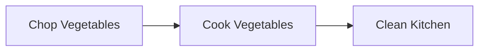
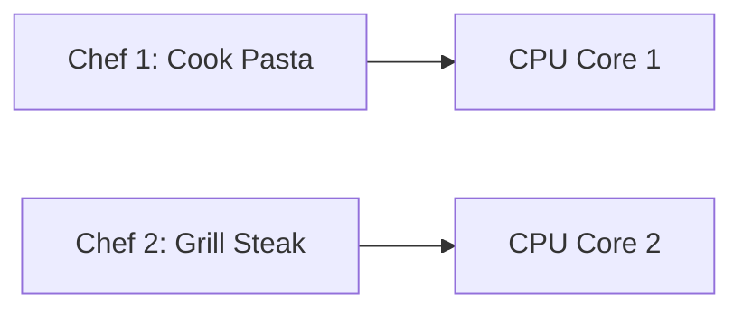

# Concurrency in Golang
## **Understanding Sequential, Concurrent, and Parallel Processing in Golang**

Concurrency is a fundamental concept in Go (Golang) that allows developers to write efficient programs by leveraging multiple tasks running simultaneously or interleaved. To understand concurrency, it's essential to differentiate between **Sequential**, **Concurrent**, and **Parallel** processing.

---

## **1. Sequential Processing**

### **Definition**
- Tasks are executed one after another in a strict order.
- Each task must complete before the next one begins.
- No overlap or interleaving of tasks occurs.

### **Example**
Imagine you're preparing a meal:
1. Chop vegetables.
2. Cook the vegetables.
3. Clean the kitchen.

You cannot start cooking until chopping is complete, and cleaning cannot begin until cooking is done.

### **Visual Representation**

### **Key Characteristics**
- Single-threaded execution.
- Simple to reason about but can be inefficient for I/O-bound or time-consuming tasks.

---

## **2. Concurrent Processing**

### **Definition**
- Tasks overlap in time but may not necessarily run simultaneously.
- Tasks alternate between each other, giving the illusion of simultaneous execution.
- Concurrency is about **structure**—how tasks are organized, not necessarily how they execute.

### **Example**
Imagine a chef and a waiter working together:
1. The chef starts cooking a dish.
2. While the dish is cooking, the waiter takes an order from a customer.
3. The chef resumes cooking after the waiter finishes taking the order.

Here, the chef and waiter alternate tasks, but only one task is active at any given moment.

### **Visual Representation**

### **Key Characteristics**
- Tasks are interleaved but not necessarily parallel.
- Achieved using goroutines in Go.
- Useful for I/O-bound tasks where waiting (e.g., for file reads, network requests) can be overlapped with other work.

---

## **3. Parallel Processing**

### **Definition**
- Tasks run **simultaneously** on multiple CPU cores.
- True parallelism requires hardware support (e.g., multi-core processors).
- Parallelism is about **execution**—tasks are actively running at the same time.

### **Example**
Imagine two chefs working in a kitchen:
1. Chef 1 cooks pasta.
2. Chef 2 grills steak.
Both tasks happen simultaneously because there are two chefs (CPU cores).

### **Visual Representation**

### **Key Characteristics**
- Requires multiple CPU cores.
- Achieved in Go by running goroutines on different OS threads.
- Useful for CPU-bound tasks like mathematical computations or data processing.

---

## **Comparison Table**

| Feature               | **Sequential**                          | **Concurrent**                          | **Parallel**                           |
|-----------------------|-----------------------------------------|-----------------------------------------|----------------------------------------|
| **Execution Order**   | One task at a time, in strict order.    | Tasks overlap in time but alternate.    | Tasks run simultaneously on multiple cores. |
| **Hardware Dependency**| Single-threaded (no dependency).        | Single-threaded or multi-threaded.      | Multi-core processors required.       |
| **Use Case**          | Simple, predictable workflows.          | I/O-bound tasks (e.g., network, files). | CPU-bound tasks (e.g., math, encryption). |
| **Efficiency**        | Low (tasks block each other).           | High (tasks interleave efficiently).    | Very high (true multitasking).         |

---