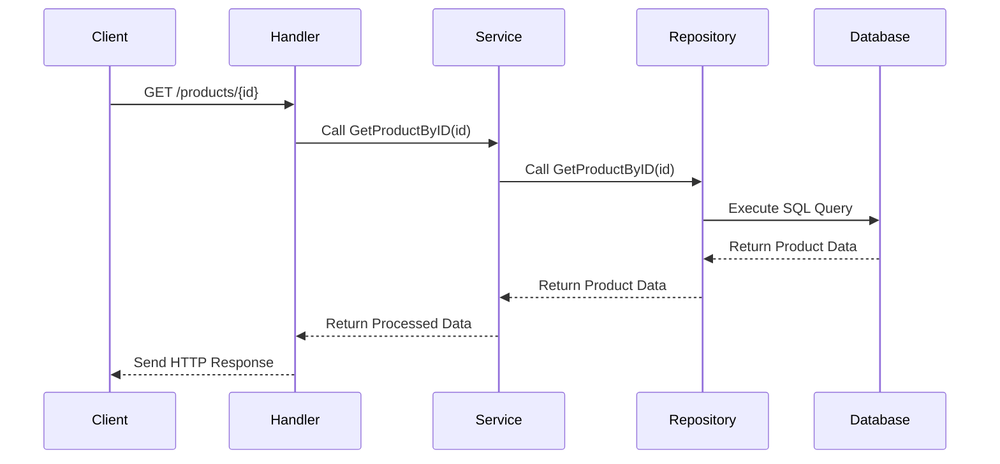
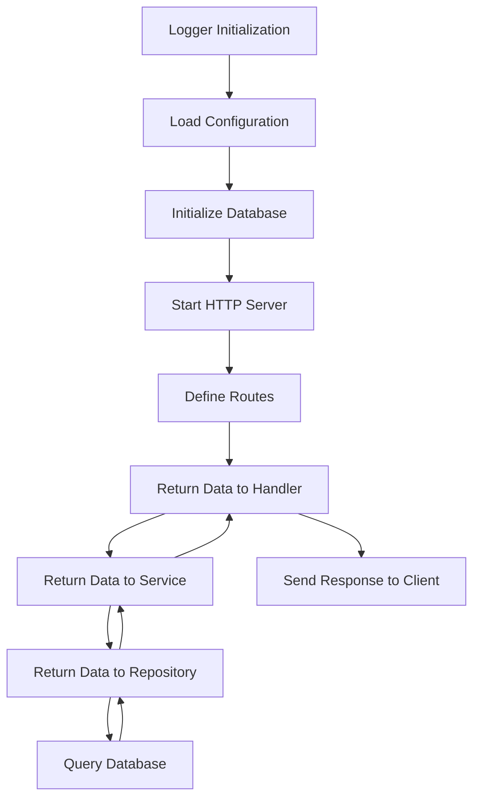

#  **The complete flow of Go API project**

### **1. Initialization Flow**

#### **A. Logger Initialization**
- **Purpose**: Set up structured logging using `logrus`.
- **Code**:
  ```go
  var logger = logrus.New()

  func init() {
      if err := godotenv.Load(); err != nil {
          logger.Warn("No .env file found, using environment variables directly.")
      }
      logger.SetFormatter(&logrus.JSONFormatter{})
      logger.SetOutput(os.Stdout)
      logger.SetLevel(logrus.InfoLevel)
  }
  ```
- **Flow**:
  1. Load environment variables from a `.env` file (if it exists).
  2. Configure `logrus` to output logs in JSON format.
  3. Set the log level to `Info` (logs only info-level messages and above).

---

#### **B. Configuration Loading**
- **Purpose**: Load application settings (e.g., database credentials, API port) from environment variables.
- **Code**:
  ```go
  config, err := configs.LoadConfig()
  if err != nil {
      logger.Fatalf("Failed to load configuration: %v", err)
  }
  ```
- **Flow**:
  1. The `configs.LoadConfig()` function retrieves environment variables like `DATABASE_HOST`, `DATABASE_PORT`, etc.
  2. If any required variable is missing, the application exits with an error.

---

#### **C. Database Initialization**
- **Purpose**: Connect to the PostgreSQL database and ensure the `products` table exists.
- **Code**:
  ```go
  db, err := utils.InitializeDB(config.Database)
  if err != nil {
      logger.Fatalf("Failed to initialize database: %v", err)
  }
  defer db.Close()

  if err := utils.CreateProductsTable(db); err != nil {
      logger.Fatalf("Failed to create products table: %v", err)
  }
  ```
- **Flow**:
  1. Establish a connection to the database using the `InitializeDB` function.
  2. Ensure the `products` table exists by calling `CreateProductsTable`.

---

### **2. Interaction Between Repository, Service, and Handler Layers**

The interaction between these layers ensures a clean separation of concerns and makes the code modular, testable, and maintainable.

---

#### **A. Why Do We Need the Service Layer?**
The **service layer** acts as an intermediary between the **handler** and **repository** layers. Its purpose is to:
1. **Encapsulate Business Logic**:
   - For example, validating data, applying business rules, or performing calculations.
2. **Decouple Handlers from Repositories**:
   - Handlers focus on HTTP-specific tasks (e.g., parsing requests), while repositories handle database queries.
3. **Enable Reusability**:
   - Business logic can be reused across multiple handlers or even other parts of the application.

Without the service layer, handlers would directly interact with the repository, leading to tightly coupled code that is harder to maintain and test.

---

#### **B. How the Layers Interact**
Here’s how the layers work together:

1. **Handler Layer**:
   - Receives HTTP requests and parses input data.
   - Calls the service layer to process the request.
   - Sends the response back to the client.

2. **Service Layer**:
   - Implements business logic (e.g., validating input, processing data).
   - Calls the repository layer to interact with the database.

3. **Repository Layer**:
   - Executes database queries (e.g., fetching, inserting, updating data).
   - Returns raw data to the service layer.

---

#### **C. Example: Fetching a Product by ID**
Let’s break down the flow for the `/products/{id}` endpoint:

##### **Step 1: Handler Layer**
- **Code**:
  ```go
  router.HandleFunc("/products/{id}", handler.GetProductByIDHandler).Methods("GET")
  ```
- **Flow**:
  1. The router matches the request to the `GetProductByIDHandler` function.
  2. The handler extracts the `id` parameter from the URL and calls the service layer.

##### **Step 2: Service Layer**
- **Code**:
  ```go
  product, err := h.Service.GetProductByID(id)
  ```
- **Flow**:
  1. The service layer validates the `id` (if needed).
  2. It calls the repository layer to fetch the product from the database.

##### **Step 3: Repository Layer**
- **Code**:
  ```go
  query := "SELECT id, name, quantity, price FROM products WHERE id = $1"
  row := r.DB.QueryRow(query, id)
  ```
- **Flow**:
  1. The repository executes a SQL query to fetch the product by its ID.
  2. It returns the result to the service layer.

##### **Step 4: Back to Service and Handler**
- The service layer processes the result (if needed) and returns it to the handler.
- The handler formats the response and sends it back to the client.

---

#### **D. Mermaid Diagram: Layer Interaction**
Below is a Mermaid diagram showing how the layers interact:



---

### **3. Why Use This Structure?**

#### **A. Separation of Concerns**
Each layer has a specific responsibility:
- **Handlers**: Handle HTTP-specific tasks (e.g., parsing requests, formatting responses).
- **Services**: Implement business logic and orchestrate operations.
- **Repositories**: Manage database interactions.

This separation makes the code easier to understand, test, and maintain.

#### **B. Testability**
- You can test each layer independently:
  - Mock the repository when testing the service layer.
  - Mock the service when testing the handler layer.

#### **C. Scalability**
- As your application grows, you can add new features without cluttering existing code.
- For example, you can add caching in the service layer without modifying the handler or repository.

---

### **4. Complete Project Flow Diagram**

Below is a Mermaid diagram summarizing the entire project flow:



---

### **5. Key Takeaways**
1. **Initialization**:
   - Set up logging, load configuration, and connect to the database.
2. **Layered Architecture**:
   - Handlers → Services → Repositories → Database.
3. **Service Layer**:
   - Encapsulates business logic and decouples handlers from repositories.
4. **Benefits**:
   - Clean separation of concerns, improved testability, and scalability.