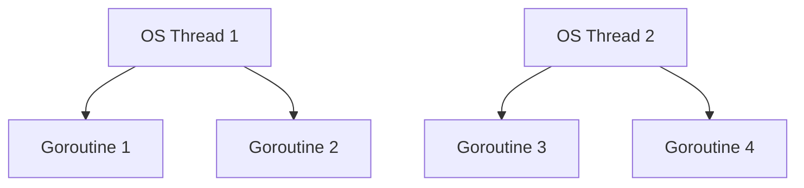
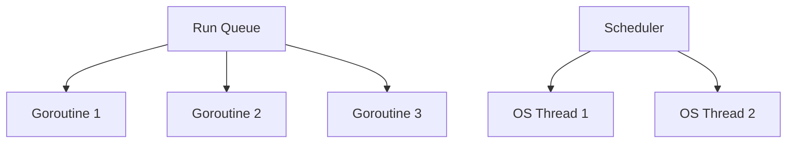

# Table of Contents

1. [Understanding Goroutines, Go Runtime Scheduler, and Concurrency in Golang](#understanding-goroutines-go-runtime-scheduler-and-concurrency-in-golang)  
   - [1. What Are Goroutines in Golang?](#1-what-are-goroutines-in-golang)  
     - [Define Goroutines](#define-goroutines)  
     - [What Happens When You Start a Goroutine?](#what-happens-when-you-start-a-goroutine)  
       - [Multiplexing Explained](#multiplexing-explained)  
       - [Visual Representation of Multiplexing](#visual-representation-of-multiplexing)  
     - [Goroutines vs Threads](#goroutines-vs-threads)  
     - [Context Switching in Goroutines](#context-switching-in-goroutines)  

   - [2. What Is the Go Runtime Scheduler?](#2-what-is-the-go-runtime-scheduler)  
     - [Why Is It Considered a Cooperative Scheduler?](#why-is-it-considered-a-cooperative-scheduler)  
     - [Which Algorithm Does It Use to Schedule Goroutines?](#which-algorithm-does-it-use-to-schedule-goroutines)  
       - [Round-Robin Scheduling](#round-robin-scheduling)  
       - [Visual Representation of Round-Robin Scheduling](#visual-representation-of-round-robin-scheduling)  

   - [3. Key Concepts in Goroutines and Scheduling](#3-key-concepts-in-goroutines-and-scheduling)  
     - [Global Run Queue vs Local Run Queues](#global-run-queue-vs-local-run-queues)  
     - [Work Stealing](#work-stealing)  
     - [Preemption in Go 1.14+](#preemption-in-go-114)  

4. [Summary Table: Goroutines vs Threads](#summary-table-goroutines-vs-threads)  

5. [Reference](#reference)  
   - [Go Routines](./goroutine.md)

# **Understanding Goroutines, Go Runtime Scheduler, and Concurrency in Golang**

Concurrency is one of the core strengths of Go (Golang), and **goroutines** are the building blocks of concurrent programming in Go. To fully grasp how goroutines work, it's essential to understand their relationship with the **Go runtime scheduler**, **context switching**, and how they compare to traditional threads.

---

## **1. What Are Goroutines in Golang?**

### **Define Goroutines**
- **Definition**: A goroutine is a lightweight thread of execution managed by the Go runtime.
- **Key Features**:
  - Lightweight: Starts with a small stack (~2KB) that grows dynamically as needed.
  - Cheap: Thousands of goroutines can run concurrently without significant overhead.
  - Managed by Go runtime: The Go scheduler handles the execution of goroutines on OS threads.

### **What Happens When You Start a Goroutine?**
When you start a goroutine using the `go` keyword, the following happens:
1. The Go runtime creates a new goroutine.
2. The goroutine is added to the **global run queue** or a **local run queue** (depending on the scheduler).
3. The Go runtime **multiplexes** goroutines onto a smaller number of OS threads for execution.

#### **Multiplexing Explained**
- **Definition**: Multiplexing means running multiple goroutines on a smaller number of OS threads.
- **How It Works**:
  - Goroutines are scheduled onto OS threads by the Go runtime.
  - If a goroutine performs a blocking operation (e.g., I/O), the runtime moves it off the OS thread, allowing other goroutines to execute.
  - This ensures efficient use of CPU resources and avoids wasting OS threads on blocked operations.

#### **Visual Representation of Multiplexing**

---

### **Goroutines vs Threads**
| Feature                | **Goroutines**                              | **OS Threads**                              |
|------------------------|---------------------------------------------|--------------------------------------------|
| **Memory Usage**       | ~2KB (dynamic stack)                        | ~1MB (fixed stack)                         |
| **Creation/Cost**      | Lightweight and fast                       | Heavyweight and slow                       |
| **Switching**          | Managed by Go scheduler                    | Managed by OS kernel                       |
| **Scalability**        | Thousands can run concurrently             | Hundreds at most                           |
| **Blocking Behavior**  | Non-blocking operations allow other goroutines to run | Blocking operations block the entire thread |

---

### **Context Switching in Goroutines**
- **Definition**: Context switching is the process of saving and restoring the state of a goroutine so that execution can resume later.
- **Advantages in Goroutines**:
  - Faster than OS thread context switching because it does not involve the kernel.
  - Managed by the Go runtime, which uses a **cooperative scheduling model**.
- **Cooperative Scheduling**:
  - Goroutines voluntarily yield control (e.g., during I/O, channel operations, or `time.Sleep`).
  - No preemption: The scheduler does not forcibly interrupt running goroutines.

---
 #### Refer to the coding part
 [Go Routines](./goroutine.md)

---

## **2. What Is the Go Runtime Scheduler?**

### **Why Is It Considered a Cooperative Scheduler?**
- **Definition**: The Go runtime scheduler is cooperative because goroutines voluntarily yield control to the scheduler.
- **Key Characteristics**:
  - Goroutines yield control during blocking operations (e.g., I/O, channel sends/receives).
  - The scheduler ensures fairness by distributing goroutines across available OS threads.

---

### **Which Algorithm Does It Use to Schedule Goroutines?**
The Go runtime scheduler uses a **round-robin algorithm** to distribute goroutines fairly across OS threads.

#### **Round-Robin Scheduling**
- **Definition**: Each goroutine gets an equal opportunity to execute on an OS thread.
- **How It Works**:
  - Goroutines are placed in a **run queue**.
  - The scheduler picks the next goroutine from the queue and assigns it to an available OS thread.
  - If a goroutine blocks (e.g., waiting for I/O), it is moved off the thread, and the scheduler picks another goroutine.

#### **Visual Representation of Round-Robin Scheduling**

---

## **3. Key Concepts in Goroutines and Scheduling**

### **Global Run Queue vs Local Run Queues**
- **Global Run Queue**:
  - Shared by all OS threads.
  - Used when a goroutine is created but not yet assigned to a specific thread.
- **Local Run Queues**:
  - Each OS thread has its own local queue.
  - Improves performance by reducing contention between threads.

---

### **Work Stealing**
- **Definition**: When a thread runs out of goroutines in its local queue, it "steals" work from the global queue or other threads' local queues.
- **Purpose**: Ensures load balancing and prevents idle threads.

---

### **Preemption in Go 1.14+**
- Before Go 1.14, goroutines were non-preemptive, meaning they would not be interrupted unless they yielded control.
- Starting with Go 1.14, the runtime introduced **asynchronous preemption**:
  - Allows the scheduler to interrupt long-running goroutines.
  - Ensures fairness and prevents starvation.

---

## **Summary Table: Goroutines vs Threads**

| Feature               | **Goroutines**                              | **OS Threads**                              |
|-----------------------|---------------------------------------------|--------------------------------------------|
| **Managed By**        | Go runtime                                 | OS kernel                                  |
| **Memory Overhead**   | ~2KB                                       | ~1MB                                       |
| **Creation Cost**     | Low                                        | High                                       |
| **Context Switching** | Fast (user-space)                          | Slow (kernel-space)                        |
| **Blocking Behavior** | Non-blocking operations allow others to run| Blocks the entire thread                  |
| **Scheduling**        | Cooperative (round-robin)                  | Preemptive                                |

---