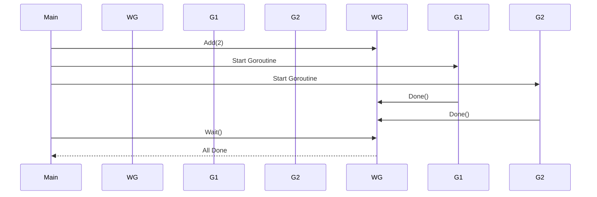

# **Understanding WaitGroups in Golang: Theoretical Concepts**

In concurrent programming, synchronization is crucial to ensure that multiple goroutines work together without causing race conditions or leaving tasks incomplete. **WaitGroups** are a synchronization primitive in Go that allow you to wait for a collection of goroutines to finish their execution before proceeding further.

---

## **1. What Are WaitGroups?**

### **Definition**
- A **WaitGroup** is a part of the `sync` package in Go.
- It waits for a group of goroutines to complete their execution.
- It is particularly useful when you need to coordinate multiple goroutines and ensure that the main function (or another goroutine) does not exit prematurely.

---

## **2. Important Methods in WaitGroups**

The `sync.WaitGroup` type provides three key methods:

| **Method** | **Description**                                                                                   |
|------------|---------------------------------------------------------------------------------------------------|
| `Add(n)`   | Increments the WaitGroup counter by `n`. This indicates how many goroutines are being waited on. |
| `Done()`   | Decrements the WaitGroup counter by 1. This signals that a goroutine has completed its task.     |
| `Wait()`   | Blocks the calling goroutine until the WaitGroup counter reaches zero.                          |

---

### **How WaitGroups Work**
1. **Initialization**: Create a `sync.WaitGroup` object.
2. **Adding Tasks**: Use `Add(n)` to specify the number of goroutines to wait for.
3. **Marking Completion**: Each goroutine calls `Done()` when it finishes its task.
4. **Blocking Until Completion**: The main goroutine (or another coordinating goroutine) calls `Wait()` to block until all goroutines have called `Done()`.

---

## **3. Example: Using WaitGroups**

Below is an example demonstrating the use of `sync.WaitGroup` with explanations.

### **Code Example**
```go
package main

import (
	"fmt"
	"sync"
	"time"
)

func worker(id int, wg *sync.WaitGroup) {
	defer wg.Done() // Decrement the counter when the goroutine completes
	fmt.Printf("Worker %d starting\n", id)
	time.Sleep(time.Second) // Simulate work
	fmt.Printf("Worker %d done\n", id)
}

func main() {
	var wg sync.WaitGroup

	// Add 3 workers to the WaitGroup
	for i := 1; i <= 3; i++ {
		wg.Add(1) // Increment the counter for each worker
		go worker(i, &wg)
	}

	// Wait for all workers to finish
	wg.Wait()
	fmt.Println("All workers completed")
}
```

### **Output**
```
Worker 1 starting
Worker 2 starting
Worker 3 starting
Worker 1 done
Worker 2 done
Worker 3 done
All workers completed
```

---

### **Step-by-Step Explanation**
1. **Initialization**:
   - A `sync.WaitGroup` object (`wg`) is created.
   - The `Add(1)` method is called for each worker, incrementing the counter to 3.

2. **Goroutine Execution**:
   - Three goroutines are started, each executing the `worker` function.
   - Inside the `worker` function, `defer wg.Done()` ensures that the counter is decremented when the goroutine finishes.

3. **Blocking with `Wait()`**:
   - The main goroutine calls `wg.Wait()`, which blocks until the counter reaches zero (i.e., all workers call `Done()`).

4. **Completion**:
   - Once all workers complete, the main goroutine resumes and prints "All workers completed."

---

## **4. Key Points About WaitGroups**

### **Why Use WaitGroups?**
- **Synchronization**: Ensures that the main goroutine waits for other goroutines to finish.
- **Prevents Premature Exit**: Prevents the program from exiting before all tasks are completed.
- **Simple and Effective**: Easy to use for coordinating a fixed number of goroutines.

---

### **Common Mistakes to Avoid**
1. **Forgetting `Add`**:
   - If you forget to call `Add(n)`, the counter may already be zero, causing `Wait()` to return prematurely.
   - Always match `Add(n)` with the number of goroutines being launched.

2. **Forgetting `Done`**:
   - If a goroutine does not call `Done()`, the counter will never reach zero, causing `Wait()` to block indefinitely.
   - Use `defer wg.Done()` to ensure `Done()` is always called, even if the goroutine encounters an error.

3. **Reusing WaitGroups**:
   - Do not reuse a `WaitGroup` after its counter has reached zero. Instead, create a new `WaitGroup` for subsequent tasks.

---

## **5. Visual Representation of WaitGroups**

### **Mermaid Diagram: WaitGroup Workflow**


---

## **6. When to Use WaitGroups**

### **Use Cases**
1. **Parallel Task Execution**:
   - When you need to execute multiple tasks concurrently and wait for all of them to finish.
   - Example: Processing multiple files, making API calls, or performing database queries in parallel.

2. **Batch Processing**:
   - When processing a batch of items where each item is handled by a separate goroutine.

3. **Testing Concurrent Code**:
   - In unit tests, ensure that all goroutines complete before asserting results.

---

### **When Not to Use WaitGroups**
1. **Dynamic Task Creation**:
   - If the number of tasks is not known upfront, consider using channels or other synchronization mechanisms.
2. **Complex Dependencies**:
   - For complex workflows with dependencies between tasks, consider using higher-level abstractions like `context.Context` or libraries like `errgroup`.

---

## **7. Comparison Table: WaitGroups vs Channels**

| Feature               | **WaitGroups**                                      | **Channels**                                       |
|-----------------------|-----------------------------------------------------|---------------------------------------------------|
| **Purpose**           | Synchronize completion of goroutines.              | Communicate data between goroutines.             |
| **Use Case**          | Waiting for a fixed number of tasks to complete.    | Sending/receiving data between goroutines.       |
| **Error Handling**    | Limited (requires manual error tracking).           | Can propagate errors through channels.           |
| **Complexity**        | Simple for basic synchronization.                   | More flexible but can be harder to manage.       |

---