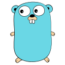

# Let Us Go

## **Golang Programming Language Documentation**

  

## **Table of Contents**

<strong>Basics</strong>

1. [Introduction](./Basics/intro.md)
2. [General Structure of a Go Program](./Basics/structure.md)
3. [Operators and Control Flow](./Basics/operators_and_control_flow.md)
4. Collections
   - [Arrays](./Basics/arrays.md)
   - [Slices](./Basics/slices.md)
   - [Maps](./Basics/maps.md)
5. [Functions](./Basics/functions.md)
6. [Pointers](./Basics/pointers.md)
7. [Structs, Methods, and Interfaces](./Basics/structs_methods_interfaces.md)

<strong>Intermediate</strong>

1. Concurrency in Go lang
    - [Concurrency](./Intermediate/concurrency.md)
    - [Go Routines and Go Run Time](./Intermediate/go_routine&go_runtime.md)
    - [Go Routines Implementation](./Intermediate/goroutine.md)
    - [Wait Groups](./Intermediate/wait_groups.md)
    - [Channels](./Intermediate/channels.md)
2. Modules, Pacakges and Imports
    - [Packages](./Intermediate/packages.md)
    - [Core Packages](./Intermediate/core_packages.md)
3. API Development:
    - [API Development in GoLang](./Intermediate/api_development.md)
    - [The complete flow of Go API project](./Intermediate/go_api_project_flow.md)

